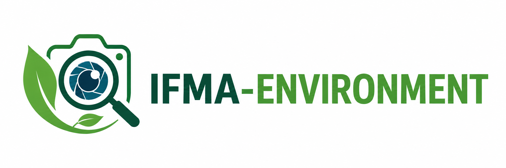

<div align="center">
  
</div>

<br>

<h1 align="center">🌿 IFMA-ENVIRONMENT</h1>

<p align="center">
  <strong>Análise ambiental de objetos com Inteligência Artificial</strong>
</p>

<p align="center">
  
  
  
  
  
</p>

---

## 📋 Sobre o Projeto

O **IFMA-ENVIRONMENT** é um projeto educacional desenvolvido como ferramenta de conscientização ambiental para uso em sala de aula. Ele permite que alunos e professores tirem fotos de objetos do dia a dia e recebam, em segundos, uma análise completa sobre o impacto ambiental daquele item.

Através da **Inteligência Artificial da OpenAI (GPT-4o)**, o sistema identifica:

- 🔹 **Nome do objeto**
- 🔹 **Material principal**
- 🔹 **Tempo estimado de decomposição no meio ambiente**
- 🔹 **Malefícios ambientais** que o objeto causa
- 🔹 **Dica de descarte correto** (reciclagem, lixo comum, etc.)
- 🔹 **Nível de confiança** da análise

> 💡 *"Educação ambiental é o primeiro passo para um futuro sustentável."*

---

## 🎯 Objetivo Institucional

Este projeto foi criado com fins **institucionais e educacionais** pelo **IFMA (Instituto Federal do Maranhão)**, com os seguintes propósitos:

- ✅ **Conscientização ambiental** — Mostrar de forma prática o impacto que objetos comuns têm no planeta
- ✅ **Ferramenta pedagógica** — Auxiliar professores em aulas de ciências, biologia e geografia
- ✅ **Estímulo à tecnologia** — Apresentar conceitos de IA, programação web e integração de APIs
- ✅ **Testes em sala de aula** — Fácil de configurar e usar, basta uma foto e uma chave da OpenAI

---

## 🚀 Como o sistema funciona

```
📸 Usuário tira/escolhe uma foto
        │
        ▼
🌐 Frontend (HTML/JS) envia a imagem
        │
        ▼
⚙️ Backend (Express) recebe com Multer
        │
        ▼
🖼️ Converte para base64
        │
        ▼
🤖 Envia para API da OpenAI (GPT-4o)
        │
        ▼
📊 IA analisa e retorna JSON com dados ambientais
        │
        ▼
🖥️ Frontend exibe os resultados na tela
```

---

## 🛠️ Tecnologias Utilizadas

| Tecnologia | Versão | Para que serve |
|------------|--------|----------------|
| **Node.js** | 18+ | Ambiente de execução JavaScript no servidor |
| **Express** | 4.x | Framework web para criar o servidor HTTP |
| **Multer** | 1.x | Middleware para receber upload de imagens |
| **OpenAI SDK** | 4.x | Biblioteca oficial para chamar a API da OpenAI |
| **Dotenv** | 16.x | Gerenciar variáveis de ambiente (.env) |
| **GPT-4o** | — | Modelo de IA que analisa as imagens |

---

## 📁 Estrutura do Projeto

```
IFMA-ENVIRONMENT/
├── 📄 server.js              # Servidor principal (Express + OpenAI)
├── 📄 package.json           # Dependências e scripts
├── 📄 .env                   # Sua chave da API OpenAI
├── 📄 .gitignore             # Arquivos ignorados pelo Git
├── 📄 LICENSE                # Licença MIT
├── 🖼️ imagem_readme.png      # Banner para o README
├── 📁 public/
│   └── 📄 index.html         # Frontend (HTML + CSS + JavaScript)
└── 📁 node_modules/          # Dependências instaladas
```

---

## ⚙️ Como Rodar o Projeto

### 📌 Pré-requisitos

- [Node.js](https://nodejs.org/) versão 18 ou superior instalado
- Uma chave de API da [OpenAI](https://platform.openai.com/api-keys)

### 🧪 Passo a Passo

```bash
# 1. Entre na pasta do projeto
cd IFMA-ENVIRONMENT

# 2. Instale as dependências
npm install

# 3. Configure sua chave da OpenAI no arquivo .env
#    Abra o arquivo .env e substitua "sua_chave_aqui" pela sua chave real
#    Exemplo: OPENAI_API_KEY=sk-proj-abc123...
```

```bash
# 4. Inicie o servidor
npm start
```

```
# 5. Abra no navegador
http://localhost:3000
```

### 🖥️ Usando o Sistema

1. Abra `http://localhost:3000` no navegador
2. Clique na área de upload para escolher uma foto do seu computador ou tire uma foto pelo celular
3. Veja a prévia da imagem aparecer na tela
4. Clique em **"🔍 Analisar objeto"**
5. Aguarde alguns segundos enquanto a IA analisa a imagem
6. Pronto! Todos os dados ambientais aparecerão na tela ✨

---

## 📸 Exemplo de Resultado

### Garrafa PET

```json
{
  "objeto": "Garrafa PET",
  "material_principal": "Plástico (PET - Polietileno Tereftalato)",
  "confianca": "alta",
  "tempo_decomposicao_estimado": "Cerca de 400 anos",
  "maleficios_ambientais": [
    "Demora séculos para se decompor no meio ambiente",
    "Polui oceanos, rios e solos",
    "Pode ser ingerida por animais marinhos, causando morte"
  ],
  "descarte_recomendado": "Descartar na lixeira de plástico para reciclagem",
  "observacao": "Lave a garrafa antes de descartar para facilitar a reciclagem. Uma garrafa PET pode virar novas garrafas, tecidos ou cordas!"
}
```

---

## 🌍 Como este projeto pode ajudar

### Para Professores 👨‍🏫

| Disciplina | Como usar |
|------------|-----------|
| **Ciências / Biologia** | Mostrar tempo de decomposição e impactos de materiais no ecossistema |
| **Geografia** | Discutir poluição, descarte de resíduos e sustentabilidade |
| **Informática** | Ensinar conceitos de API, JavaScript, Node.js e integração com IA |
| **Projetos Interdisciplinares** | Unir tecnologia e meio ambiente em um só projeto prático |

### Para Alunos 🧑‍🎓

- Aprender na prática como a IA pode ser usada para o bem do planeta
- Entender o impacto ambiental de objetos que usam todos os dias
- Desenvolver pensamento crítico sobre consumo e descarte de resíduos
- Ter contato com programação web e integração de APIs

### Para a Comunidade 🏡

- Ferramenta de conscientização acessível e fácil de usar
- Pode ser usada em feiras de ciências, eventos escolares e campanhas ambientais
- Código aberto — qualquer escola pode baixar, usar e modificar

---

## 🧠 Prompt da IA (no backend)

O prompt enviado para a OpenAI está em português do Brasil, com linguagem simples e educativa:

```
Analise a imagem enviada.

Você faz parte de um projeto escolar chamado IFMA-ENVIRONMENT.

Responda em português do Brasil, de forma simples e educativa.

Identifique:
- qual é o objeto da imagem;
- qual é o material principal provável;
- quanto tempo ele pode demorar para se decompor no ambiente;
- quais problemas ele pode causar ao meio ambiente;
- como ele deve ser descartado corretamente.

Se não tiver certeza sobre o objeto, informe que a confiança é baixa.
```

---

## 📄 Licença

Este projeto está sob a licença **MIT**. Sinta-se à vontade para usar, modificar e compartilhar!

---

<p align="center">
  <strong>🌿 IFMA-ENVIRONMENT — Educação ambiental com inteligência artificial</strong><br>
  <sub>Instituto Federal do Maranhão · Projeto Educacional · Código Aberto</sub>
</p>

<p align="center">
  <sub>Feito com 💚 para um futuro mais sustentável</sub>
</p>
